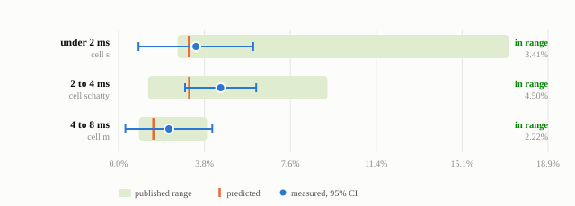
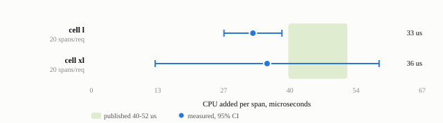

# Results

Reference run on AWS EKS: five application configurations ("cells"), six repetitions each,
120 ten-minute measurement windows, 116 accepted by the validity checks. The predictions
were committed before any data existed ([PREDICTIONS.md](PREDICTIONS.md)).

Every number below can be recomputed from the per-window data:

```sh
python3 analysis/summarize.py results/reference-run.csv
```

## Buckets

Three cells were configured to match three buckets of the overhead model - a CPU per request
inside the bucket and the median span count of applications in that bucket - and measured with
and without Odigos on the same running process.



| bucket | CPU/req | spans/req | expected | measured (95% CI) | predicted range | verdict |
|---|---|---|---|---|---|---|
| under 2 ms | 1.49 ms | 1.01 | 4.9% | 3.41% ± 2.53 | 2.6% – 17.2% | in range |
| 2 to 4 ms | 2.97 ms | 2.01 | 3.1% | 4.50% ± 1.57 | 1.3% – 9.2% | in range |
| 4 to 8 ms | 6.05 ms | 2.01 | 1.9% | 2.22% ± 1.91 | 0.9% – 3.9% | in range |

*Expected* is the model's typical overhead for applications in the bucket; the *predicted range*
is where it expects 8 in 10 of them to land.

All three landed inside their predicted range, and each expected figure lies within the
confidence interval of the measurement. Averaged across the three buckets: 3.4% measured
against 3.3% expected.

The verdict is on the measured value, as the predictions specified. How much weight each cell
carries depends on its interval: for "2 to 4 ms" the whole interval (2.9% - 6.1%) lies inside
the range, while for "under 2 ms" (0.9% - 5.9%) and "4 to 8 ms" (0.3% - 4.1%) the interval is
wider than part of the range. Those two cells are small effects measured close to what the rig
can resolve; they agree with the model rather than confirming it on their own.

This was not guaranteed. Before the run, [`analysis/power.py`](analysis/power.py) simulated the
battery 20,000 times with the model exactly true and this rig's measured noise: all three cells
land in range only about 55% of the time, because the ranges are narrow where these particular
cells fall ([PRE-DATA-POWER.md](PRE-DATA-POWER.md)).

## Latency and throughput

Latency is measured at the load generator, on a different node from the application, so it
includes the network path as a caller sees it. The comparison below uses the second window of
each phase - the second window without Odigos against the second window with it - because the
first window after a restart or after attaching carries a start-up tail that is not Odigos
(see [how to read latency](VALIDATION.md#measuring-latency-and-throughput)).

| bucket | req/s off → on | errors | dropped | p50 off → on | p95 off → on | p99 off → on |
|---|---|---|---|---|---|---|
| under 2 ms | 500 → 500 | 0 | 0 | 1.53 → 1.61 ms | 1.86 → 2.00 ms | 4.00 → 4.18 ms |
| 2 to 4 ms | 300 → 300 | 0 | 0 | 3.09 → 3.22 ms | 3.46 → 3.68 ms | 11.63 → 11.38 ms |
| 4 to 8 ms | 150 → 150 | 0 | 0 | 6.24 → 6.38 ms | 6.63 → 6.85 ms | 10.75 → 11.09 ms |

As expected with CPU headroom, every application held its target rate in every window with no
errors and no dropped requests. Median latency rose by 0.08 - 0.14 ms, matching the CPU Odigos
added per request in the same windows (0.07 - 0.17 ms): requests got slower by the agent's own
work, with no queuing on top. p95 rose by 0.13 - 0.22 ms. p99 moved by less than 0.35 ms in
either direction, with no consistent sign - within the noise of a tail percentile over a
10-minute window.

The load is a fixed arrival rate, so equal throughput is by design; what it shows is that no
application fell behind. What Odigos would cost a service running at its CPU limit - its maximum
throughput - is a different measurement, described in VALIDATION.md.

## Cost per span

Two cells carry 20 spans per request so the per-span cost is large enough to measure directly.
The second repeats the first at four times the CPU per request.



| cell | spans/req | CPU/req | CPU added | per span (95% CI) |
|---|---|---|---|---|
| l | 20.15 | 3.24 ms | 661 µs | 33 µs (27 – 39) |
| xl | 20.23 | 13.41 ms | 722 µs | 36 µs (13 – 58) |

Both came in below the 46 µs per span the bucket model uses, so the model is conservative for
services with many spans. The two agree with each other: at four times the application CPU per
request, the cost per span is unchanged, so it does not depend on how much work the
application does.

Strictly, this is outside the 40 – 52 µs range written into the predictions as a failure
condition. It fails in the favourable direction - Odigos costs less per span than predicted -
and the bucket ranges built on 46 µs hold regardless.

Fitting added CPU against span count across all five cells gives

```
added CPU per request = 52 µs + 32 µs x spans
```

The first span of a request, the server span, carries work the rest do not: creating the trace
context and making the sampling decision. A single per-span figure averages the two, which is
why `46 µs x spans` slightly under-predicts requests with one or two spans (51 µs measured vs
46 predicted for one span) and over-predicts requests with many (661 - 722 µs vs 927 - 930 for
twenty). The effect on the bucket ranges is small, which is why all three held.

## Caveats

**Cell xl is the weakest measurement.** At 58 requests per second its 6-minute warm-ups give
the application only about 21,000 requests to settle on, and in four of six repetitions one of its
windows failed the settling check and was left out. Its per-repetition values vary with which
window was lost. Including the refused windows moves its overhead from 5.4% to 6.4%; both are
below the 46 µs model's prediction. Its one 15-minute-warmed window per repetition was its most
stable, which is why [VALIDATION.md](VALIDATION.md) advises warming low-traffic services longer.

**The "under 2 ms" cell is noisy per repetition.** Its effect is about 50 µs on a 1.5 ms
baseline, near what one repetition can resolve; individual repetitions ranged from -1.0% to
+6.4%. The six-repetition mean is sound; a single repetition is not.

**Resolution.** Two consecutive uninstrumented windows on the same process differed by about 2% of
baseline on average. That is the smallest effect a single repetition can resolve, and it is
why the "4 to 8 ms" cell, with a predicted effect of 1.5%, was declared marginal in advance.

## How it was run

- **Cluster:** AWS EKS, Kubernetes 1.33, all nodes in one availability zone.
- **Application nodes:** one `m6i.2xlarge` (8 vCPU, Intel Xeon 3rd gen) per cell, kubelet
  static CPU manager with `full-pcpus-only`. The application pod had 2 CPUs (requests = limits)
  pinned to one physical core; no CFS quota and zero throttling in every accepted window.
- **Dependencies:** Postgres 16, Redis 7 and a Go echo service per cell, on a separate
  `m6i.xlarge` per cell. The reference run used PostgreSQL JDBC driver 42.7.10; the repository
  now pins 42.7.13 for two security fixes, a patch-level change far below what the rig can resolve.
- **Load:** k6 at a fixed arrival rate on its own node, holding each application at 0.6 - 0.95
  of a core without Odigos - under half of its 2 vCPUs.
- **Odigos:** Odigos Enterprise, a pre-release build of 1.36, 100% sampling.
- **Per repetition:** the application started once; 15 minutes warm-up; two 10-minute windows
  without Odigos; Odigos enabled on the running process (no restart); 6 minutes warm-up; two
  10-minute windows with Odigos. The later windows each warmed 6 minutes under the same load.
- **CPU:** the application container's own cgroup counter over the window, divided by the
  requests actually served.
- **Span counts:** measured at the collector, not assumed: 1.01, 2.01, 2.01, 20.15 and 20.23
  spans per request against 1, 2, 2, 20 and 20 designed.

The full method and every validity check are in [METHODOLOGY.md](METHODOLOGY.md).
